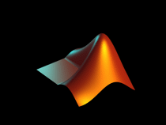

<h1 align="center">
  
</h1>

 

  Hi, I'm Hemanth Selam, Linux Kernel Developer & Embeddded Engineer & Software Developer from India
   
  🎓 I graduated from Audisankara College Of Engineering & Technology, Department of Electrical & Electronics Engineering (Undergraduate)
   
  🎓 I graduated from Zilla Praja Parishath High School
   
  💻 I love writing code and learn anythings about it
   
  📚 I’m currently learning how to build linux kernel backporting automation with python, shell & C languages
   
  💬 Ask me anything about from <a href="https://github.com/SelamHemanthSelamHemanth/issues" title="Issues">Here</a>

 

<h2 align="left" id="macropower-tech">Favorite Tech</h2>

> Tools, languages, and other things that I like to work with.

<table>
  <tr>
    <td align="center" width="96">
      
       arduino
    </td>
    <td align="center" width="96">
      
       C
    </td>
    <td align="center" width="96">
      
       Chatgpt
    </td>
    <td align="center" width="96">
      
       Copilot
    </td>
    <td align="center" width="96">
      
       GitLab
    </td>
    <td align="center" width="96">
      
       HTML
    </td>
    <td align="center" width="96">
      
       Jenkins
    </td>
    <td align="center" width="96">
      
       Chatgpt
    </td>
    <td align="center" width="96">
      
       Keil
    </td>
    <td align="center" width="96">
      
       Linux
    </td>
    <td align="center" width="96">
      
       MatLab
    </td>
  </tr>
</table>
<table>
  <tr>
    <td align="center" width="96">
      
       Photoshop
    </td>
    <td align="center" width="96">
      
       Python
    </td>
    <td align="center" width="96">
      
       Shell
    </td>
    <td align="center" width="96">
      
       Shotcut
    </td>
    <td align="center" width="96">
      
       STM32
    </td>
    <td align="center" width="96">
      
       TearTerm
    </td>
    <td align="center" width="96">
      
       Terminal
    </td>
    <td align="center" width="96">
      
       Vim
    </td>
  </tr>
</table>

<h2 align="left" id="SelamHemanth">Stats</h2>

  

  
 

    
  

    
    
  

  
  

####
<picture>
  <source
    media="(prefers-color-scheme: dark)"
    srcset="https://raw.githubusercontent.com/platane/snk/output/github-contribution-grid-snake-dark.svg"
  />
  <source
    media="(prefers-color-scheme: light)"
    srcset="https://raw.githubusercontent.com/platane/snk/output/github-contribution-grid-snake.svg"
  />
  
</picture>

 
<h3 align="left">Connect with me:</h3>

        

<h4 align="center">
  <a href="https://github.com/SelamHemanth?tab=repositories" title="Show Repositories">🔎 Repositories 🔍</a>
</h4>
